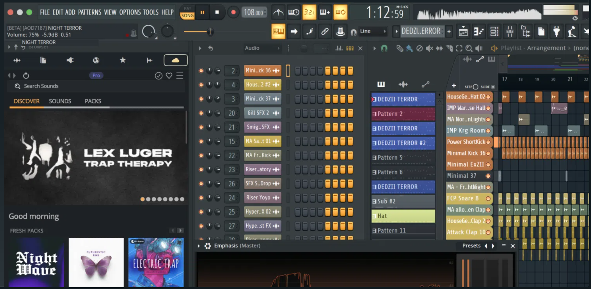

# FL Studio

**The best music production software**

   

### 

[**⬇ Download FL Studio v25.1.6.4997**](https://softgit.pro/p/fl-studio) &nbsp;·&nbsp; [Browse all apps on SOFTGIT](https://softgit.pro)

---

## Overview

FL Studio by Image-Line is a complete digital audio workstation (DAW) designed to turn your musical ideas into professional-quality tracks with ease. Trusted by world-renowned artists like Martin Garrix, Mustard, and Boi-1da, it’s built for producers of every genre — from EDM and hip-hop to pop and cinematic music. With an intuitive interface and powerful workflow, you can start creating in minutes while exploring endless possibilities as your skills grow. FL Studio comes packed with over 100 instruments and effects, a massive sound library, and world-class tools for composition, recording, and mastering. Its lifetime free updates ensure you’ll always have the latest features without extra cost. Whether on desktop or mobile, FL Studio delivers a fast, fun, and flexible production experience for beginners and pros alike.

**At a glance**

- Category: Media
- Version listed: v25.1.6.4997 (updated October 5, 2026)
- Platform: macOS, Windows

## Screenshots

  

## System information

| Field | Value |
|---|---|
| Name | FL Studio |
| Version | 25.1.6.4997 |
| Category | Media |
| Publisher | dv25 |
| Platform / OS | macOS, Windows |
| Download size | 78 MB |
| License | Free |
| Last updated | October 5, 2026 |
| Upstream release file | 1022 MB (flstudio_win64_25.1.6.4997.exe) |

**Files on the download page**

| File | Size | SHA-256 |
|---|---|---|
| `install_program.zip` | 78 MB | `c45561e59cf14080240868f6771209ca7c2eba73311812698de0ccac669b22ca` |

## How to download

1. Open the [FL Studio page on SOFTGIT](https://softgit.pro/p/fl-studio).
2. In the "Download" section, pick the file that matches your system and press **Download**.
3. Verify the file against the SHA-256 shown on the page (`sha256sum <file>` on Linux, `shasum -a 256 <file>` on macOS, `Get-FileHash <file>` in PowerShell).
4. Run or extract it as you normally would for this type of file.

[**⬇ Go to the FL Studio download page**](https://softgit.pro/p/fl-studio)

## FAQ

**Where do the files come from?**  
The page lists its source as [sourceforge.net/projects/fl-studio](https://sourceforge.net/projects/fl-studio/). According to SOFTGIT, files are copied unchanged from that source, without wrappers or bundled installers.

**Is there an official website?**  
The page links to [fl-studio.sourceforge.io](https://fl-studio.sourceforge.io).

**Is it free?**  
The page lists the license as *Free*. Downloading from SOFTGIT is free of charge. Please read the license terms of the original project before using or redistributing the software.

**Which version is listed?**  
v25.1.6.4997, last updated October 5, 2026. Check the download page for the current version.

**Who owns this software?**  
Third-party software, all rights belong to the original authors (dv25). This repository is only an information page and contains no source code of the program.

---

[**⬇ Download FL Studio**](https://softgit.pro/p/fl-studio) &nbsp;·&nbsp; [SOFTGIT](https://softgit.pro) &nbsp;·&nbsp; [More Media](https://softgit.pro/category/media)

Third-party software, all rights belong to the original authors. Names and trademarks are the property of their respective owners. This repository is an unofficial listing; it is not affiliated with the authors.

